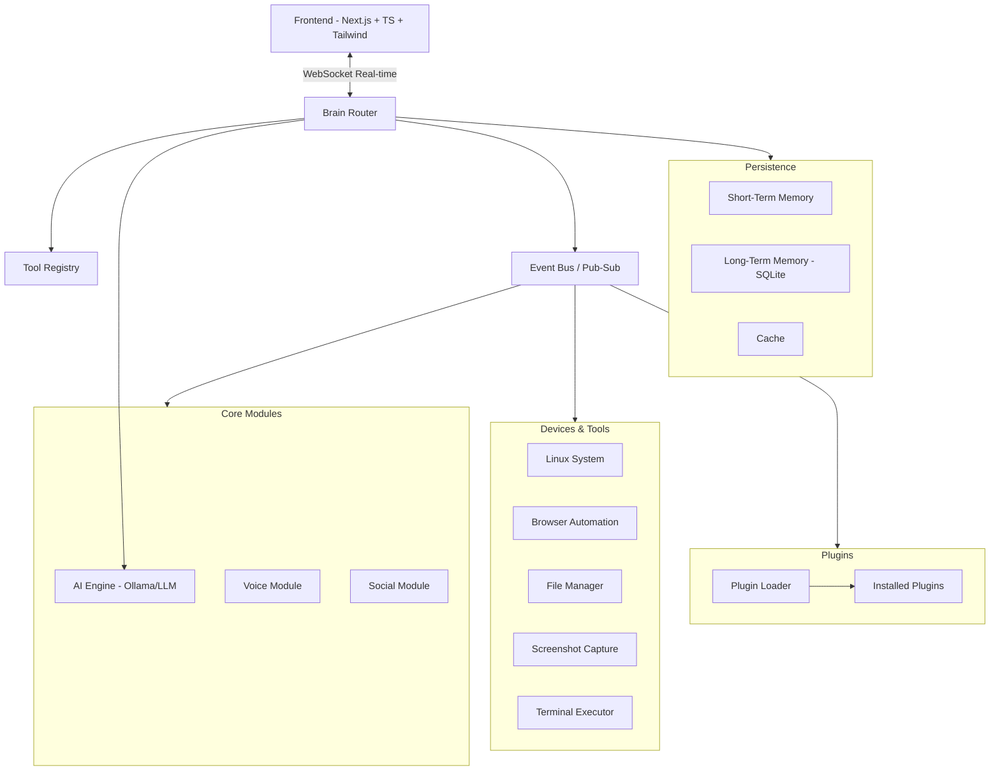
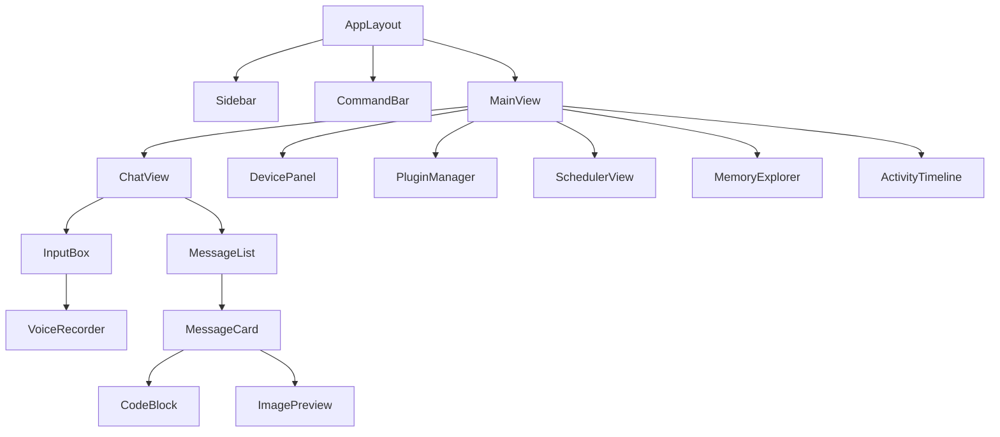
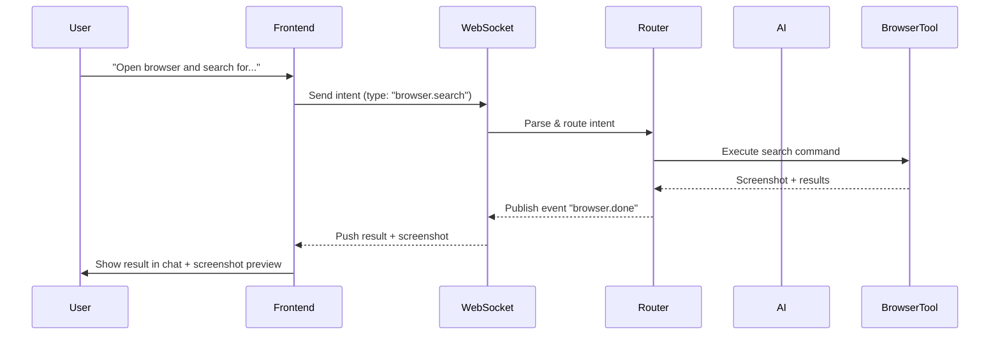

<div align="center">
  <h1>
    
    Nivi — Your Intelligent Command Center
    
  </h1>

  <p><strong>The AI agent that orchestrates your digital life — devices, apps, data, and automation, all from a single interface.</strong></p>

  <p>
    
    
    
    
  </p>
</div>

---

## 🧠 What is Nivi?

Nivi is not just another chatbot. It’s a **proactive, extensible AI assistant** that can:

- Execute system commands (Linux, Terminal)
- Browse the web autonomously
- Manage files and folders
- Capture and analyze your screen
- Schedule tasks and reminders
- Communicate via voice and text
- Integrate with social platforms
- Learn from your habits (long‑term memory)
- Control external plugins and devices

All of this happens through a **real‑time, event‑driven architecture** and a modern, sleek frontend that turns Nivi into a true **command center** for your digital world.

---

## 🏗️ High‑Level System Architecture



**The frontend never talks directly to devices.** It streams intents via WebSocket to the router, which orchestrates everything asynchronously. Results flow back through the event bus and are pushed to the UI in real time.

---

## 🎨 Frontend — The Command Center

The Nivi frontend is a **blazing‑fast, AI‑native workspace** designed to feel like an extension of your mind. It’s built with:

- **Next.js 14** (App Router, server components)  
- **TypeScript** (end‑to‑end type safety)  
- **Tailwind CSS** (utility‑first, custom design system)  
- **Framer Motion + GSAP** (fluid, meaningful animations)  
- **Zustand** (lightweight state management)  
- **TanStack Query** (server‑state caching & syncing)  
- **WebSocket** (real‑time bidirectional communication)  
- **Biome** (lightning‑fast linting & formatting)

### ✨ Core Frontend Features

| Feature | Description |
|--------|-------------|
| **Live Conversation** | Chat interface with streaming AI responses, voice input/output, and rich media (code blocks, images) |
| **Device Control Panel** | One‑click buttons to trigger system commands, take screenshots, open browsers, etc. |
| **Plugin Marketplace** | Browse, install, and manage plugins directly from the UI |
| **Task Scheduler** | Visual cron editor for automated tasks |
| **Memory Browser** | Explore what Nivi remembers about you — editable and transparent |
| **Activity Timeline** | Real‑time log of every action Nivi takes, filterable by type |
| **Split‑View Workspace** | Run multiple tools side‑by‑side (e.g., terminal + browser output) |
| **Dark/Light Themes** | Polished with system preference detection |
| **Keyboard‑Driven (⌘K)** | Command palette inspired by Linear/Raycast for power users |

### 🧩 Frontend Component Architecture



All components are **lazy‑loaded** with Next.js dynamic imports for minimal bundle impact. The UI stays snappy even when dozens of tools are running.

---

## 🔗 Real‑Time Data Flow



The entire system is **event‑driven** — the frontend subscribes to exactly the events it cares about, keeping bandwidth minimal and experience reactive.

---

## 📁 Project Structure (Visualized)

```
Nivi/
├── main.py                 # (Orchestrator) حلقة التشغيل الرئيسية ومدير العمليات
├── router.py               # (Brain Router) موجه المهام (يقرر من يفعل ماذا)
├── registry.py             # (Tool Registry) تسجيل الأدوات والإضافات ديناميكياً
├── config.json             # الإعدادات العامة للنظام
├── .env                    # المتغيرات السرية (API Keys, Tokens)
├── requirements.txt        # المكتبات المطلوبة
├── README.md               # توثيق المشروع
├── .gitignore              # ملفات تجاهل الـ Git
│
├── data/                   # (Data Storage)
│   ├── nivi.db             # قاعدة بيانات SQLite (الذاكرة طويلة المدى)
│   ├── cache/              # ملفات مؤقتة
│   ├── models/             # ملفات النماذج المحلية (Ollama GGUF)
│   └── uploads/            # الملفات المرفوعة من المستخدم
│
├── logs/                   # (System Logs) سجلات الأخطاء والعمليات
│
├── events/                 # (Event Bus) نظام الأحداث (المراسلات بين الأجزاء)
│   ├── __init__.py
│   └── bus.py              # الموزع المركزي للأحداث (Pub/Sub)
│
├── scheduler/              # (Automation) المهام المجدولة
│   ├── __init__.py
│   └── tasks.py            # المهام التي تعمل في الخلفية (Cron jobs)
│
├── memory/                 # (Memory Unit) العقل المستمر
│   ├── __init__.py
│   ├── core.py             # الذاكرة الأساسية (الهوية والقواعد)
│   ├── short_term.py       # الذاكرة القصيرة (سياق المحادثة)
│   └── long_term.py        # الذاكرة الطويلة (SQLite Interface)
│
├── modules/                # (Core Logic) الذكاء والمنطق
│   ├── __init__.py
│   ├── ai.py               # المحرك المفكر (Ollama/LLM Integration)
│   ├── voice.py            # محرك تحويل النص لصوت والعكس
│   └── social.py           # منطق التواصل الاجتماعي
│
├── devices/                # (Hardware/External Tools) الأدوات والأجهزة
│   ├── __init__.py
│   ├── linux.py            # أوامر النظام
│   ├── browser.py          # أدوات المتصفح
│   ├── files.py            # التعامل مع الملفات
│   ├── screenshot.py       # تصوير الشاشة
│   └── terminal.py         # تنفيذ أوامر التيرمينال
│
├── plugins/                # (Dynamic Extensibility) الإضافات الخارجية
│   ├── __init__.py
│   ├── loader.py           # محمل الإضافات
│   ├── manifest.py         # تعريف الإضافات
│   └── installed/          # الإضافات المثبتة
│
├── network/                # (API & Communication)
│   ├── __init__.py
│   ├── websocket.py        # للتواصل اللحظي (Real-time)
│   ├── protocol.py         # بروتوكولات الاتصال
│   └── auth.py             # التحقق من الهوية والأمان
│
└── frontend/               # (UI Layer) الواجهة (مستقبلية)
    └── README.md           # توثيق تقنيات الواجهة (Next.js + TS + Tailwind)
```

---

## 🚀 Getting Started (Frontend)

### Prerequisites
- Node.js 18+
- npm / yarn / pnpm
- Backend server running (see main README for backend setup)

### Installation

```bash
git clone <your-repo-url>
cd Nivi/frontend
npm install
```

### Environment Variables

Create `.env.local`:

```env
NEXT_PUBLIC_WS_URL=ws://localhost:8765
NEXT_PUBLIC_API_URL=http://localhost:5000
```

### Run Development Server

```bash
npm run dev
```

Open [http://localhost:3000](http://localhost:3000) and start chatting with Nivi.

### Code Quality

```bash
npm run lint      # Biome linting
npm run format    # Biome formatting
```

---

## 🌟 Why Nivi’s Frontend Is Different

- **Not a wrapper** – The UI is a first-class citizen, designed to expose the full power of the backend without complexity.
- **Extensible by nature** – The plugin system has a dedicated UI for installation and management, so anyone can add capabilities without touching core code.
- **Real‑time everything** – Thanks to WebSockets, you see screenshots, logs, and tool outputs as they happen.
- **Memory transparency** – You can inspect and even edit what Nivi remembers, giving you control over its behavior.
- **Future‑proof** – The architecture supports voice UI, mobile companion apps, and even AR overlays without rewriting the core logic.

---

## 🔮 Roadmap (Frontend)

- [x] Real‑time WebSocket connection  
- [x] Chat streaming with AI  
- [x] Device control panel  
- [x] Plugin marketplace  
- [ ] Voice‑first mode (hands‑free interaction)  
- [ ] Mobile responsive PWA  
- [ ] Offline mode with local LLM (via WebLLM)  
- [ ] Desktop app via Tauri  
- [ ] Collaboration (multiple Nivi instances sharing context)


<div align="center">
  <p>Built with obsession by <strong>Abn-Alyatim</strong></p>
  <p>
    <a href="mailto:alyateemmadin@gmail.com">
      
    </a>
  </p>
  <p>
    <sub>✨ "Any sufficiently advanced technology is indistinguishable from magic." — Arthur C. Clarke</sub>
  </p>
</div>
```
